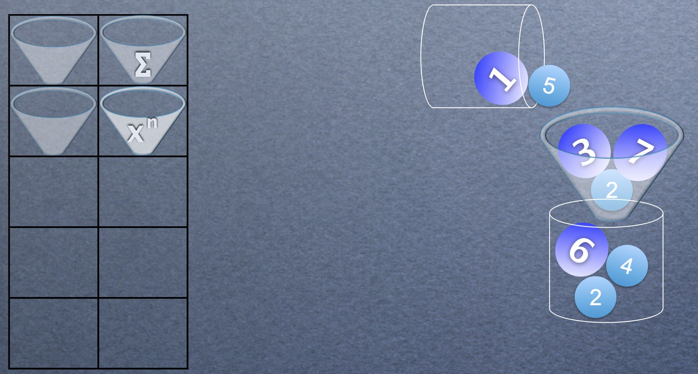

# MathWorks
Mathworks is a kids game for the kids who are starting to make sense of the types of numbers, for example perfects, odds, multiples of a number, squares, set etc...  You could imagine a Paint-brush like UI with a function-tool box on the left and with 2 buckets, one empty and another full of numbers.  A kid selects a filter and places it on the empty bucket and then drops the bucket of full on to the empty bucket as shown in the diagram below:



Based on the nature of the filter, a few numbers pass the filter and end-up in the target bucket and a few remain in the filter.

## Stories
MathWorks First story is already implemented. 

**Story #1: Understanding Primes**

```
As a Kid learning mathematics,
I want to be able to identify perfect numbers
So that I can understand what perfects are.
```

**Acceptance Criteria #1**

```
Given numbers 1, 2, 3, 4, 5, 6, 10 and 28
When using Perfect filter and emptying contents of the source bucket to target bucket
Then target bucket should contain 6 and 28.
```
**Acceptance Criteria #2**

```
Given numbers -2, -1, 0, and 6
When using Perfect filter and emptying contents of the source bucket to target bucket
Then target bucket should contain 6.
```

You are now hired by MathWorks and tasked with implementing from Story #2 onwards.  You may download the [story slides](stories/mathworks-kids-game.pdf). 

## (Re-)Generate IDE Specific files
* To generate or regenerate after adding/removing a new dependency, for creating an Eclipse project: use ```gradle cleanEclipse eclipse```
* To generate or regenerate after adding/removing a new dependency, for creating an Idea project: use ```gradle cleanIdea idea```

## To Build 
Simply run ```gradlew clean build``` or ```gradle clean build``` on the command line.

## To Start Test Loop 
In the Terminal, use ==> ```gradle -t test```.  
    
